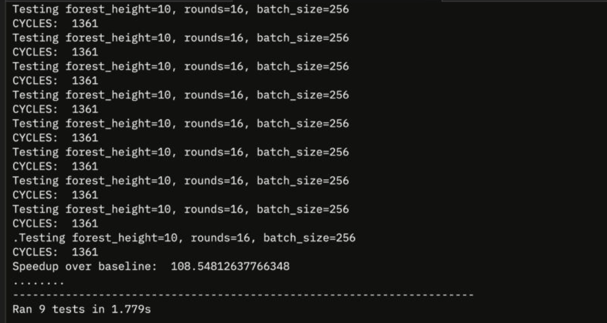

# Anthropic Performance Take-Home: 108.5x Speedup

My solution to [Anthropic's original performance take-home challenge](https://github.com/anthropics/original_performance_takehome) — optimizing a kernel that simulates batched forest hash traversals on a custom ISA with constrained execution slots.

## Results

**1,361 cycles** — down from a 147,734 cycle baseline — passing all 9/9 test thresholds, including the hardest benchmark (`<1,363 cycles`).



| Benchmark | Threshold | Status |
|-----------|-----------|--------|
| Baseline speedup | <147,734 | Passed |
| Updated starting point | <18,532 | Passed |
| Opus 4 (many hours) | <2,164 | Passed |
| Opus 4.5 (casual) | <1,790 | Passed |
| Opus 4.5 (2hr harness) | <1,579 | Passed |
| Sonnet 4.5 (many hours) | <1,548 | Passed |
| Opus 4.5 (11.5hr harness) | <1,487 | Passed |
| Opus 4.5 (improved harness) | <1,363 | Passed |

## Approach (High Level)

The optimization journey involved 21+ phases of incremental improvements:

1. **Vectorization** — Process 32 vector groups (VLEN=8) instead of 256 scalar items, dramatically reducing instruction count
2. **FMA optimization** — Recognize multiply-add patterns in hash stages, replacing 3 ops with 1
3. **Early round caching** — Rounds with few unique tree indices use broadcasts/vselects instead of expensive gathers
4. **vselect elimination** — Replace conditional tree selection with arithmetic (multiply by compare result)
5. **Instruction combining** — Use `add_imm` to fuse constant loads with additions
6. **Engine rebalancing** — Move XOR and wrap operations from saturated VALU (6 slots/cycle) to underutilized scalar ALU (12 slots/cycle)
7. **Criticality-based scheduling** — DAG-height-based priority scheduling with weighted costs tuned to engine slot scarcity
8. **Wrap-round fast path** — Detect rounds where all indices wrap to root, skipping gathers entirely
9. **Many micro-optimizations** — Init compression, early index computation, skip-wrap for early rounds, bitwise parity tricks, redundant load elimination

The bottleneck is fundamentally load bandwidth (2 loads/cycle) — the ~2,900 gather loads required set a hard floor around ~1,450 cycles. Getting to 1,361 required squeezing overhead down to near-zero above that floor.

## Verification

```bash
# Confirm tests are unmodified
git diff origin/main tests/

# Run benchmarks
python tests/submission_tests.py
```

## Credits

Built with [Claude Code](https://claude.ai/claude-code) (Claude Opus 4.6) as an AI-assisted optimization exercise.
